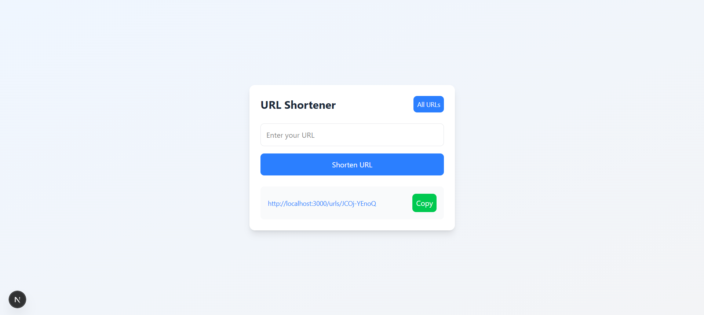
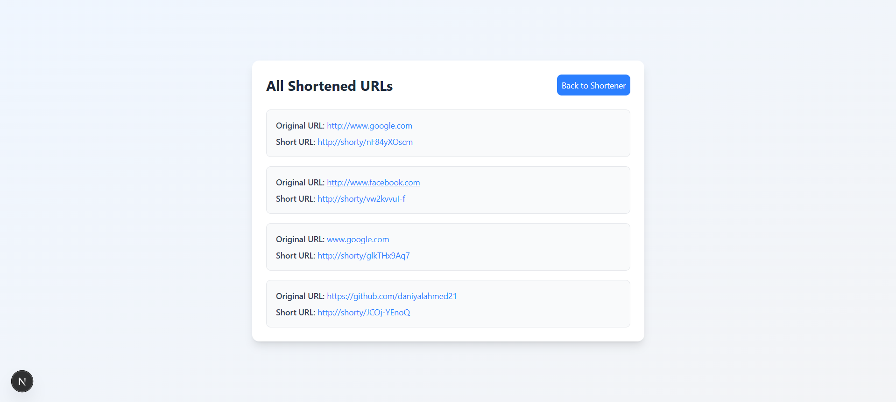

# URL Shortener

A modern full-stack URL shortener application built with Next.js. This project allows users to shorten long URLs, view a list of all shortened links, and be seamlessly redirected from a short URL to its original destination.

## ✨ Features

  * **URL Shortening**: A clean and user-friendly form to generate unique, short URLs.
  * **Dynamic Redirection**: A dedicated route that fetches the original URL from the database and redirects the user.
  * **List View**: A separate page to view a list of all existing shortened URLs.
  * **Copy-to-Clipboard**: Convenient one-click copying of the shortened URL.
  * **Robust Backend**: Utilizes a repository pattern for clean separation of concerns and robust database interactions.
  * **Responsive UI**: A modern, responsive user interface styled with Tailwind CSS.

## 🚀 Tech Stack

**Frontend/UI**

  * **React**
  * **Next.js** (Client Components)
  * **Tailwind CSS**
  * **Axios**

**Backend/API**

  * **Next.js** (API Routes & Server Components)
  * **nanoid** (for generating short IDs)

**Database**

  * **MongoDB**
  * **Mongoose** (for schema and model definition)

